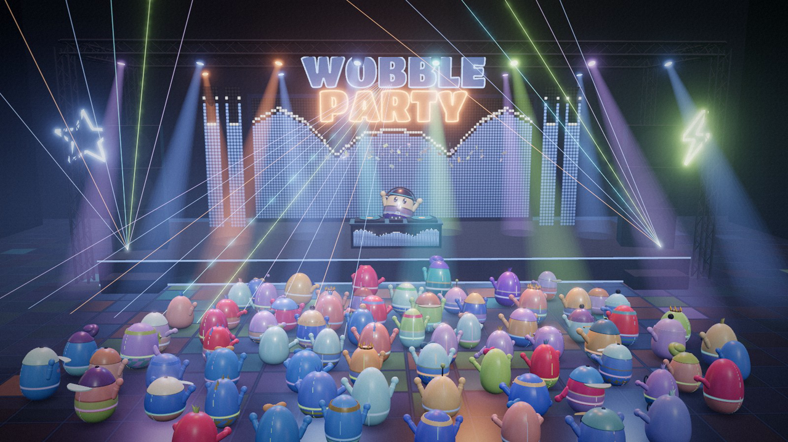
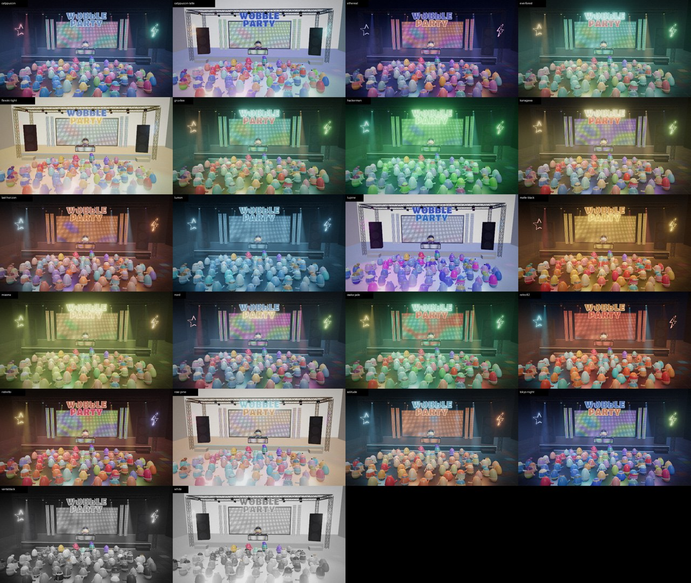

# Wobble Party



A 3D party for [Omarchy](https://omarchy.org). Play music — in **cliamp**, Spotify in the browser,
anything that comes out of your speakers — and open Wobble Party: a DJ wobbler spins behind the
booth while a crowd of wobbling vinyl toys bounces, sways, sings along and loses it on the drop.
Lights, lasers, LED walls, camera and crowd colours all follow your Omarchy theme.

Wobblers are weeble-style toys: no legs. They bob, squash, stretch, shimmy, rock, spin and jump on
their weighted round bottoms, with little arms for fist pumps, claps, waves and raising the roof.

## Install

```bash
omarchy plugin add https://github.com/RidgetopAi/wobble-party --enable
```

Then click the little wobbler in your bar. The first click builds the brain (needs Rust:
*Omarchy menu → Install → Development → Rust*), later clicks start and stop the party.

Or from a clone:

```bash
./packaging/install.sh          # builds and installs wobble-party + wobble-brain to ~/.local/bin
wobble-party                    # open the party (also in the app launcher)
wobble-party toggle             # open/close — bind it to a key:
#   ~/.config/hypr/bindings.lua:  o.bind("SUPER + ALT + W", "Wobble Party", "wobble-party toggle")
./packaging/install.sh --uninstall
```

Optional Hyprland rules (float, size, opacity, no idle while fullscreen) are in
[`packaging/hyprland/wobble-party.lua`](packaging/hyprland/wobble-party.lua).

### Keys

| key | |
|---|---|
| `space` | next camera shot |
| `1`–`9` | hold a shot (wide, DJ, over-the-DJ, crowd dolly, hero close-up, crane, overhead, orbit, stage side) · `0` back to auto |
| `t` / `T` | preview the next installed theme / back to the current one |
| `f` | fullscreen |
| `d` | signal debugger (what the party is hearing) |
| `h` | help · `q` quit |

## How it works

```
default sink monitor (pw-record)
  -> wobble-brain (Rust, ~2% of a core)
       bands, onsets, kicks · causal tempo + beat-phase tracker · song sections (build / drop / calm)
       singing voice: a small GRU trained on a cappella ground truth -> presence, loudness, syllables, pitch
  -> WebSocket frames (~94/s) + your Omarchy theme
  -> stage (Three.js in a Chromium app window)
       music state with a predictive beat clock -> show director (lights, lasers, LEDs, confetti)
       -> camera director (cuts on bars, blends in calm, hero close-ups on vocal phrases)
       -> one choreographer per wobbler (personality, physics rig, face)
```

Nothing is rerouted: the brain listens to your default output's monitor, so it hears whatever is
playing, with no added latency to what you hear. It exits a few seconds after the window closes.

**Rhythm.** Beats come from a local clock extrapolated and phase-locked to the brain, so hops are
launched *before* the beat and land on it (measured: median landing error ~0 ms, all within ±60 ms,
with deliberate per-dancer humanising).

**Singing.** Mouths open with the singer's loudness, syllables pop, phrases make the crowd lean in
and sway, high notes stretch them taller. The detector is a 2-layer GRU (~120k parameters) running
in plain Rust on mel features; trained on 77 a cappellas x 57 instrumentals with augmentation, it
reaches AUC 0.88 on singers and instrumentals it never saw (the DSP-only baseline reached 0.65).

**Themes.** Each Omarchy theme becomes a light rig, crowd palette and venue; monochrome themes
become a black-and-silver club and light themes a daylight party. Theme changes cross-fade live.



## Develop

```bash
cd stage && npm ci && npm run dev            # stage on :5188 (proxies the brain)
cargo run --release --manifest-path brain/Cargo.toml -- serve   # brain on :7477
# http://127.0.0.1:5188/?demo  (no brain needed)   ?lab  (character lineup)
```

Rebuild the embedded stage with `npm run build` in `stage/` before `cargo build`.

Feedback loops in `tools/`:

| tool | checks |
|---|---|
| `report.py` | tempo vs BPM ground truth, vocal/drop/section stats, signal plots per track |
| `vocal_fit.py`, `vocal_train.py` | vocal detector against a cappella ground truth; trains and exports the GRU |
| `timing.mjs` | where the crowd's landings fall relative to the beat |
| `render.mjs` | deterministic video of a song section (with audio) + contact sheets |
| `themes.mjs` | the same moment under every installed theme |
| `shot.mjs`, `probe.mjs` | single-frame captures; live brain check |

## Credits

- Vocal model training data: Creative Commons stems from ccMixter — see
  [docs/TRAINING_DATA.md](docs/TRAINING_DATA.md).
- Sign lettering: [Titan One](https://fonts.google.com/specimen/Titan+One) (SIL Open Font License).
- Built with [three.js](https://threejs.org), [axum](https://github.com/tokio-rs/axum),
  [rustfft](https://github.com/ejmahler/RustFFT).
